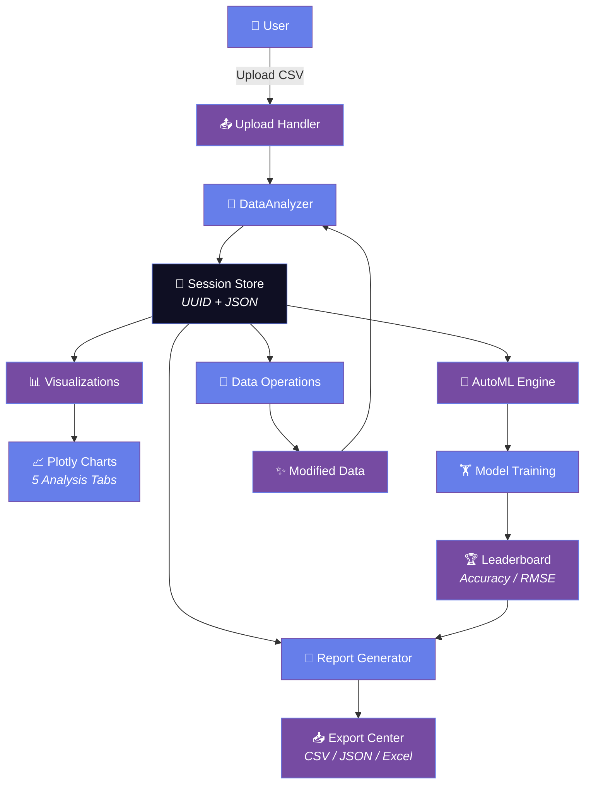

<div align="center">

<!-- Animated Typing SVG Header -->
<a href="https://git.io/typing-svg">
  
</a>

<!-- Animated Gradient Divider -->


<br>

<!-- Animated Badges -->
<p>
  
  
  
  
  
  
  
  
  
  
  
  
  
</p>

<!-- Repo Stats -->
<p>
  
  
  
  
</p>

<!-- Visitor Count -->


<br><br>

<!-- GitHub Contribution Snake -->
<picture>
  <source media="(prefers-color-scheme: dark)" srcset="https://raw.githubusercontent.com/issu321/issu321/output/github-contribution-grid-snake-dark.svg">
  <source media="(prefers-color-scheme: light)" srcset="https://raw.githubusercontent.com/issu321/issu321/output/github-contribution-grid-snake.svg">
  
</picture>

</div>

---

## 🚀 Overview

**AI Data Scientist** is a production-grade, full-stack data science platform built with **Flask** and deployable on **AWS**. It transforms raw CSV data into actionable insights through an intuitive web interface — featuring drag-and-drop upload, automated data profiling, interactive Plotly visualizations, AutoML model training, and comprehensive report generation.

> 🎯 **Goal**: Democratize data science by giving anyone the power to analyze, visualize, and model their data without writing a single line of code.

<div align="center">
  
  
  
</div>

---

## ✨ Core Features

<details open>
<summary><b>📤 1. CSV Upload & Validation</b></summary>
<br>

- Drag-and-drop interface with real-time progress animation
- Automatic file type validation (CSV, TSV, Excel)
- Schema inference and data type detection
- Upload history tracking with UUID-based session management

</details>

<details>
<summary><b>🔍 2. Data Explorer</b></summary>
<br>

- Full statistical profiling (mean, median, std, quartiles)
- Data quality scores with color-coded indicators
- Missing value analysis with pattern detection
- Duplicate row detection and summary statistics
- Column-level cardinality and uniqueness metrics

</details>

<details>
<summary><b>📊 3. Interactive Visualizations</b></summary>
<br>

Powered by **Plotly** with 5 dedicated analysis tabs:

| Tab | Charts | Description |
|-----|--------|-------------|
| **Overview** | Correlation Heatmap, Missing Value Pattern | High-level dataset health |
| **Numeric** | Histogram, Box Plot | Distribution & outlier analysis |
| **Categorical** | Bar Chart, Pie Chart | Frequency & proportion analysis |
| **Advanced** | PCA, K-Means Clustering, Pairwise Relationships | ML-ready diagnostics |
| **Custom Builder** | Bar, Line, Scatter, Pie, Histogram, Box, Heatmap, 3D | Build-your-own charts |

</details>

<details>
<summary><b>💡 4. AI Insights</b></summary>
<br>

- Auto-generated data quality warnings
- Correlation strength detection (strong/moderate/weak)
- Missing value impact scoring
- Distribution skewness & kurtosis alerts
- Actionable recommendations for data cleaning

</details>

<details>
<summary><b>🤖 5. AutoML Engine</b></summary>
<br>

- Automatic problem type detection (Classification / Regression)
- Smart model selection across scikit-learn algorithms
- Hyperparameter tuning with cross-validation
- Model leaderboard with accuracy, precision, recall, F1, RMSE
- Export trained models as pickle files

</details>

<details>
<summary><b>🔧 6. Data Operations</b></summary>
<br>

- Transform: normalize, standardize, log-transform
- Filter: row/column filtering with conditions
- Sort: multi-column ascending/descending
- Create: derived columns with formula builder
- Clean: drop duplicates, fill missing values, remove outliers

</details>

<details>
<summary><b>📑 7. Report Generation</b></summary>
<br>

- **HTML Reports**: Styled, shareable web reports
- **JSON Reports**: Machine-readable structured output
- **TXT Reports**: Plain text summaries
- One-click download with timestamped filenames

</details>

<details>
<summary><b>📥 8. Export Center</b></summary>
<br>

- CSV (raw & cleaned)
- JSON (structured data)
- Excel (.xlsx with multiple sheets)
- Cleaned CSV (post-processing export)

</details>

<details>
<summary><b>🧠 9. Session Management</b></summary>
<br>

- UUID-based multi-user support
- In-memory session storage with JSON persistence
- Session history and dataset versioning
- Settings persistence per user session

</details>

<details>
<summary><b>🎨 10. Dark Theme UI</b></summary>
<br>

- Glassmorphism card design with backdrop blur
- Animated neuron particle background (Canvas 2D)
- Liquid button hover effects with gradient shimmer
- Fully responsive mobile-first layout
- Custom scrollbars and smooth transitions

</details>

---

## 🏗️ Architecture



### Working Flow

```
┌─────────────┐     ┌─────────────┐     ┌─────────────┐     ┌─────────────┐
│ Upload CSV  │────▶│ Auto Profile│────▶│ Generate Viz│────▶│ AI Insights │
└─────────────┘     └─────────────┘     └─────────────┘     └─────────────┘
       │                   │                   │
       ▼                   ▼                   ▼
┌─────────────┐     ┌─────────────┐     ┌─────────────┐
│  Data Ops   │◄────│ Session Store│────▶│   AutoML    │
└─────────────┘     └─────────────┘     └─────────────┘
       │                                         │
       ▼                                         ▼
┌─────────────┐     ┌─────────────┐     ┌─────────────┐
│   Export    │◄────│   Reports   │◄────│   Results   │
└─────────────┘     └─────────────┘     └─────────────┘
```

---

## 🛠️ Tech Stack

<div align="center">

<table>
  <tr>
    <td align="center" width="120">
      
      <br><b>Python 3.12</b>
      <br><sub>Core Language</sub>
    </td>
    <td align="center" width="120">
      
      <br><b>Flask</b>
      <br><sub>Web Framework</sub>
    </td>
    <td align="center" width="120">
      
      <br><b>HTML5</b>
      <br><sub>Markup</sub>
    </td>
    <td align="center" width="120">
      
      <br><b>CSS3</b>
      <br><sub>Styling</sub>
    </td>
    <td align="center" width="120">
      
      <br><b>JavaScript</b>
      <br><sub>Interactivity</sub>
    </td>
  </tr>
  <tr>
    <td align="center" width="120">
      
      <br><b>AWS EC2 / EB</b>
      <br><sub>Cloud Hosting</sub>
    </td>
    <td align="center" width="120">
      
      <br><b>SQLite / JSON</b>
      <br><sub>Persistence</sub>
    </td>
    <td align="center" width="120">
      
      <br><b>Pandas</b>
      <br><sub>Data Processing</sub>
    </td>
    <td align="center" width="120">
      
      <br><b>NumPy</b>
      <br><sub>Numerical Computing</sub>
    </td>
    <td align="center" width="120">
      
      <br><b>Plotly</b>
      <br><sub>Visualizations</sub>
    </td>
  </tr>
</table>

</div>

---

## 📦 Installation

### Prerequisites

- Python 3.12+
- pip
- Git

### Local Setup

```bash
# 1. Clone the repository
git clone https://github.com/issu321/AI-Data-Scientist-Flask-AWS.git
cd AI-Data-Scientist-Flask-AWS

# 2. Create virtual environment
python -m venv venv

# 3. Activate virtual environment
# Linux / macOS
source venv/bin/activate
# Windows
# venv\Scripts\activate

# 4. Install dependencies
pip install -r requirements.txt

# 5. Run the application
python app.py

# 6. Open in browser
# http://localhost:5000
```

### Docker (Optional)

```bash
# Build image
docker build -t ai-data-scientist .

# Run container
docker run -p 5000:5000 ai-data-scientist
```

---

## ☁️ AWS Deployment

### Elastic Beanstalk (Recommended)

```bash
# 1. Install EB CLI
pip install awsebcli

# 2. Initialize application
eb init -p python-3.12 AI-Data-Scientist

# 3. Create environment
eb create ai-data-scientist-env

# 4. Open deployed app
eb open

# 5. Deploy updates
eb deploy
```

### AWS EC2 Manual Deployment

```bash
# 1. Launch EC2 instance (Amazon Linux 2023 / Ubuntu 22.04)
# 2. SSH into instance
ssh -i your-key.pem ec2-user@your-ec2-ip

# 3. Install dependencies
sudo yum update -y
sudo yum install python3 python3-pip git -y

# 4. Clone and setup
git clone https://github.com/issu321/AI-Data-Scientist-Flask-AWS.git
cd AI-Data-Scientist-Flask-AWS
pip3 install -r requirements.txt

# 5. Run with Gunicorn
gunicorn -w 4 -b 0.0.0.0:8000 app:app

# 6. Configure Nginx reverse proxy (optional)
# 7. Open security group port 80/443
```

---

## 📁 Directory Structure

```
AI-Data-Scientist-Flask-AWS/
│
├── app.py                      # Flask application entry point
├── data_analyzer.py            # Core analytics & profiling engine
├── automl_engine.py            # Machine learning pipeline
├── requirements.txt            # Python dependencies
│
├── static/
│   ├── css/
│   │   └── style.css           # Glassmorphism dark theme styles
│   └── js/
│       └── main.js             # Neuron background, interactions, animations
│
├── templates/                  # 16 Jinja2 HTML templates
│   ├── base.html               # Master layout with glassmorphism UI
│   ├── index.html              # Landing page
│   ├── upload.html             # CSV drag & drop upload
│   ├── explorer.html           # Data profiling & quality scores
│   ├── visualizations.html     # 5-tab Plotly chart dashboard
│   ├── insights.html           # AI-generated data warnings
│   ├── automl.html             # AutoML model training & leaderboard
│   ├── data_operations.html    # Transform, filter, sort, clean
│   ├── export_center.html      # CSV / JSON / Excel downloads
│   ├── reports.html            # HTML / JSON / TXT report generation
│   ├── dashboard.html          # Main analytics dashboard
│   ├── history.html            # Session & upload history
│   ├── settings.html           # User preferences
│   ├── contact.html            # Contact form
│   ├── 404.html                # Custom error page
│   └── 500.html                # Server error page
│
├── uploads/                    # Temporary CSV storage
├── visualizations/             # Debug & cached chart outputs
│
└── data/
    ├── history.json            # Upload session history
    ├── reports.json            # Generated reports metadata
    └── settings.json           # User settings persistence
```

---

## 🎬 Demo

<div align="center">

### 🖼️ Screenshot Carousel

| Upload | Explorer | Visualizations |
|:------:|:--------:|:--------------:|
| *Drag & drop your CSV* | *Full data profiling* | *Interactive Plotly charts* |

| AutoML | Data Ops | Reports |
|:------:|:--------:|:-------:|
| *Train models in one click* | *Transform & clean data* | *Export professional reports* |

<br>

<!-- Try it Live Button -->
<a href="#deployment-coming-soon">
  
</a>

<br><br>

<!-- Video Demo Placeholder -->
<p><i>🎥 Video demo coming soon — subscribe for updates!</i></p>

</div>

---

## 🤝 Contributing

We welcome contributions! Please follow these guidelines:

### Workflow

```
Fork → Branch → Commit → Push → Pull Request
```

### Steps

1. **Fork** the repository
2. Create a feature branch: `git checkout -b feature/amazing-feature`
3. Make your changes
4. Format code with **Black**: `black .`
5. Commit: `git commit -m "feat: add amazing feature"`
6. Push: `git push origin feature/amazing-feature`
7. Open a **Pull Request** using our template

### Issue Labels

| Label | Description |
|-------|-------------|
| `bug` | Something is broken |
| `feature` | New functionality request |
| `enhancement` | Improve existing feature |
| `documentation` | README, docs, or comments |
| `good first issue` | Great for newcomers |

### Code Style

- **Formatter**: [Black](https://black.readthedocs.io/)
- **Line length**: 88 characters
- **Docstrings**: Google style
- **Type hints**: Encouraged

---

## 📄 License

This project is licensed under the **MIT License**.

```
MIT License

Copyright (c) 2026 ISSU321

Permission is hereby granted, free of charge, to any person obtaining a copy
of this software and associated documentation files (the "Software"), to deal
in the Software without restriction, including without limitation the rights
to use, copy, modify, merge, publish, distribute, sublicense, and/or sell
copies of the Software, and to permit persons to whom the Software is
furnished to do so, subject to the following conditions:

The above copyright notice and this permission notice shall be included in all
copies or substantial portions of the Software.

THE SOFTWARE IS PROVIDED "AS IS", WITHOUT WARRANTY OF ANY KIND, EXPRESS OR
IMPLIED, INCLUDING BUT NOT LIMITED TO THE WARRANTIES OF MERCHANTABILITY,
FITNESS FOR A PARTICULAR PURPOSE AND NONINFRINGEMENT. IN NO EVENT SHALL THE
AUTHORS OR COPYRIGHT HOLDERS BE LIABLE FOR ANY CLAIM, DAMAGES OR OTHER
LIABILITY, WHETHER IN AN ACTION OF CONTRACT, TORT OR OTHERWISE, ARISING FROM,
OUT OF OR IN CONNECTION WITH THE SOFTWARE OR THE USE OR OTHER DEALINGS IN THE
SOFTWARE.
```

---

## 👤 Developer

<div align="center">

<table>
  <tr>
    <td align="center">
      <a href="https://github.com/issu321">
        
        <br>
        <b>ISSU321</b>
      </a>
      <br>
      <sub>AI & Data Science Developer</sub>
    </td>
  </tr>
</table>

<br>

<!-- Social Links -->
<p>
  <a href="https://github.com/issu321">
    
  </a>
  <a href="https://issu321.github.io/issu321">
    
  </a>
</p>

<br>

<!-- Buy Me a Coffee -->
<a href="https://www.buymeacoffee.com/issu321" target="_blank">
  
</a>

</div>

---

<div align="center">

<!-- Animated Footer Divider -->


<br>

<p><i>Built with 💜 by <a href="https://github.com/issu321">ISSU321</a></i></p>
<p><sub>⭐ Star this repo if you found it useful — it helps a lot!</sub></p>

</div>
