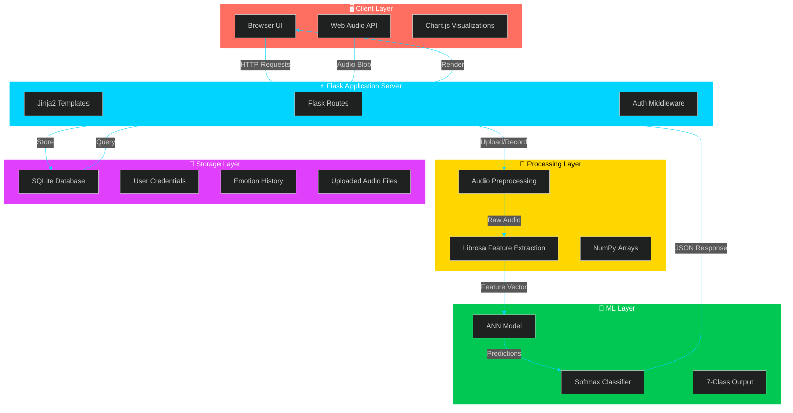
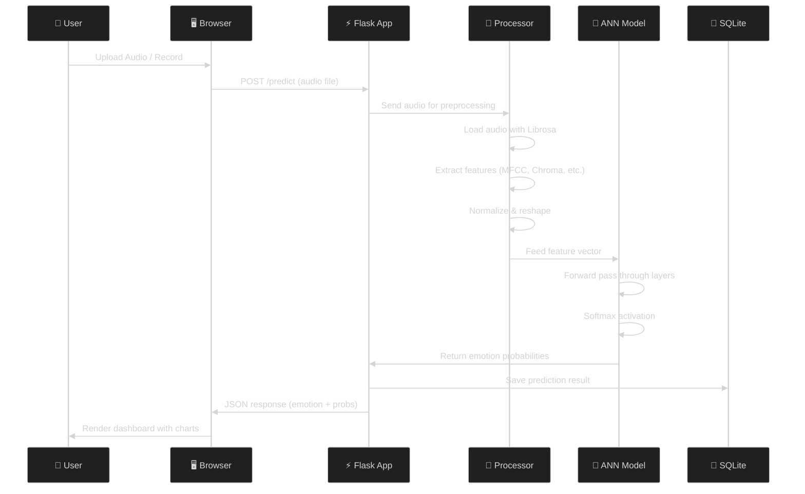
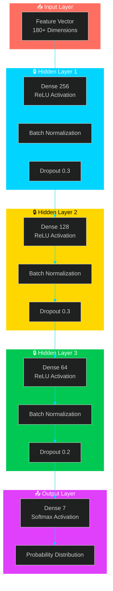
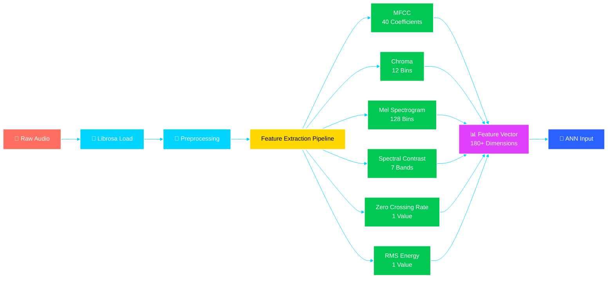

<!-- Animated Header Banner -->
<p align="center">
  
</p>

<!-- Animated Typing Badge -->
<p align="center">
  
</p>

<p align="center">
  <a href="https://python.org"></a>
  <a href="https://flask.palletsprojects.com"></a>
  <a href="https://tensorflow.org"></a>
  <a href="https://librosa.org"></a>
  <a href="LICENSE"></a>
</p>

<p align="center">
  
  
  
</p>

---


## 📋 Table of Contents

- [✨ Overview](#-overview)
- [🎯 Features](#-features)
- [🏗️ System Architecture](#%EF%B8%8F-system-architecture)
- [📊 Data Flow](#-data-flow)
- [🔧 Technology Stack](#-technology-stack)
- [🚀 Installation](#-installation)
- [💻 Usage](#-usage)
- [🎭 Emotion Classes](#-emotion-classes)
- [📈 Model Architecture](#-model-architecture)
- [🔊 Audio Feature Extraction](#-audio-feature-extraction)
- [📡 API Endpoints](#-api-endpoints)
- [🖼️ Screenshots](#%EF%B8%8F-screenshots)
- [👨‍💻 Developer](#-developer)
- [📄 License](#-license)

---


## ✨ Overview

**EmoVoice** is a cutting-edge, end-to-end **Speech Emotion Recognition (SER)** system that leverages **Artificial Neural Networks (ANN)** to detect and classify human emotions from audio signals in real-time. Built with a sleek **glass-morphism UI**, it combines powerful backend processing with an intuitive, interactive dashboard for seamless emotion analysis.

Whether you are a researcher exploring affective computing, a developer building emotion-aware applications, or simply curious about the intersection of AI and human expression — **EmoVoice** provides a complete, production-ready platform.

```mermaid
%%{init: {'theme': 'dark', 'themeVariables': { 'primaryColor': '#00D4FF', 'primaryTextColor': '#fff', 'primaryBorderColor': '#00D4FF', 'lineColor': '#00D4FF', 'secondaryColor': '#FF6F61', 'tertiaryColor': '#0d1117'}}}%%
graph LR
    A[🎙️ Audio Input] -->|Upload / Record| B[⚡ Preprocessing]
    B --> C[🔍 Feature Extraction]
    C -->|MFCC, Chroma, Mel| D[🧠 ANN Model]
    D -->|Softmax| E[📊 Emotion Output]
    E --> F[📈 Dashboard]

    style A fill:#FF6F61,stroke:#fff,stroke-width:2px,color:#fff
    style B fill:#00D4FF,stroke:#fff,stroke-width:2px,color:#fff
    style C fill:#FFD700,stroke:#fff,stroke-width:2px,color:#000
    style D fill:#00C853,stroke:#fff,stroke-width:2px,color:#fff
    style E fill:#E040FB,stroke:#fff,stroke-width:2px,color:#fff
    style F fill:#2962FF,stroke:#fff,stroke-width:2px,color:#fff
```



---


## 🎯 Features

<table align="center">
<tr>
<td align="center" width="25%">

### 🔐 Secure Auth


Secure registration and login system with password hashing and session management.

</td>
<td align="center" width="25%">

### 📁 Audio Upload


Support for **WAV, MP3, OGG, M4A, FLAC** formats with automatic format validation.

</td>
<td align="center" width="25%">

### 🎤 Real-Time Recording


Record audio directly from your browser using the Web Audio API with live waveform visualization.

</td>
<td align="center" width="25%">

### 🧠 ANN Classification


Deep ANN classifier trained on **7 emotion classes** with softmax probability output.

</td>
</tr>
<tr>
<td align="center" width="25%">

### 🔍 Feature Extraction


Extracts **6 audio features**: MFCC, Chroma, Mel Spectrogram, Spectral Contrast, ZCR, RMS.

</td>
<td align="center" width="25%">

### 📊 Interactive Dashboard


Real-time probability charts, emotion history timeline, and statistical analytics.

</td>
<td align="center" width="25%">

### 📜 Emotion History


Track and analyze emotional patterns over time with sortable history tables.

</td>
<td align="center" width="25%">

### 📱 Responsive UI


Modern glass-morphism design with gradient effects, animations, and mobile support.

</td>
</tr>
</table>

---


## 🏗️ System Architecture



---


## 📊 Data Flow



---


## 🔧 Technology Stack

<table align="center">
<tr>
<td align="center" width="33%">

### Backend


</td>
<td align="center" width="33%">

### Machine Learning


</td>
<td align="center" width="33%">

### Frontend


</td>
</tr>
</table>

---


## 🚀 Installation

### Prerequisites

- Python 3.8 or higher
- pip package manager
- Git

### Step-by-Step Setup

```bash
# 1. Clone the repository
git clone https://github.com/issu321/Emotion-Detection-AWS.git
cd Emotion-Detection-AWS

# 2. Create a virtual environment (recommended)
python -m venv venv

# 3. Activate the virtual environment
# Linux / macOS:
source venv/bin/activate
# Windows:
venv\Scripts\activate

# 4. Install dependencies
pip install -r requirements.txt

# 5. Run the application
python app.py

# 6. Open your browser and navigate to:
# http://localhost:5000
```

### Requirements

```text
Flask>=2.0.0
Flask-SQLAlchemy>=3.0.0
Flask-WTF>=1.1.0
Flask-Login>=0.6.0
Werkzeug>=2.3.0
librosa>=0.10.0
numpy>=1.24.0
tensorflow>=2.13.0
scikit-learn>=1.3.0
python-dotenv>=1.0.0
```

---


## 💻 Usage

### Quick Start Guide

```mermaid
%%{init: {'theme': 'dark', 'themeVariables': { 'primaryColor': '#00D4FF', 'primaryTextColor': '#fff', 'primaryBorderColor': '#00D4FF', 'lineColor': '#00D4FF', 'secondaryColor': '#FF6F61', 'tertiaryColor': '#0d1117'}}}%%
graph LR
    A[🚀 Start App] --> B[📝 Register]
    B --> C[🔐 Login]
    C --> D[📤 Upload Audio]
    D --> E[🎤 Or Record]
    E --> F[⚡ Analyze]
    F --> G[📊 View Results]
    G --> H[📈 Check History]

    style A fill:#FF6F61,stroke:#fff,stroke-width:2px,color:#fff
    style B fill:#00D4FF,stroke:#fff,stroke-width:2px,color:#fff
    style C fill:#00D4FF,stroke:#fff,stroke-width:2px,color:#fff
    style D fill:#FFD700,stroke:#fff,stroke-width:2px,color:#000
    style E fill:#FFD700,stroke:#fff,stroke-width:2px,color:#000
    style F fill:#00C853,stroke:#fff,stroke-width:2px,color:#fff
    style G fill:#E040FB,stroke:#fff,stroke-width:2px,color:#fff
    style H fill:#2962FF,stroke:#fff,stroke-width:2px,color:#fff
```



### Detailed Steps

1. **Register** a new account or **Login** with existing credentials
2. **Upload an audio file** (WAV, MP3, OGG, M4A, FLAC) or **Record** directly from your microphone
3. The system automatically **preprocesses** the audio and extracts **6 key features**
4. The **ANN model** predicts the emotion with **probability scores** for all 7 classes
5. View the **real-time analysis** with animated charts on the dashboard
6. Check your **emotion history** and track patterns over time

---


## 🎭 Emotion Classes

<table align="center">
<tr>
<th>Emotion</th>
<th>Icon</th>
<th>Description</th>
<th>Color Code</th>
</tr>
<tr>
<td align="center"><b>Neutral</b></td>
<td align="center">😐</td>
<td>Calm, balanced, monotone tone with no strong emotional inflection</td>
<td align="center"> #808080</td>
</tr>
<tr>
<td align="center"><b>Happy</b></td>
<td align="center">😊</td>
<td>Joyful, upbeat speech with higher pitch and faster tempo</td>
<td align="center"> #FFD700</td>
</tr>
<tr>
<td align="center"><b>Sad</b></td>
<td align="center">😢</td>
<td>Melancholic, low energy, slower speech with lower pitch</td>
<td align="center"> #4169E1</td>
</tr>
<tr>
<td align="center"><b>Angry</b></td>
<td align="center">😠</td>
<td>Intense, harsh tone with loud volume and irregular rhythm</td>
<td align="center"> #DC143C</td>
</tr>
<tr>
<td align="center"><b>Fearful</b></td>
<td align="center">😨</td>
<td>Anxious, trembling voice with pitch variations and hesitations</td>
<td align="center"> #800080</td>
</tr>
<tr>
<td align="center"><b>Disgusted</b></td>
<td align="center">🤢</td>
<td>Revulsion, aversion with nasal quality and lower pitch</td>
<td align="center"> #228B22</td>
</tr>
<tr>
<td align="center"><b>Surprised</b></td>
<td align="center">😲</td>
<td>Astonishment, shock with sudden pitch rise and energy burst</td>
<td align="center"> #FF8C00</td>
</tr>
</table>

---


## 📈 Model Architecture



### Model Specifications

| Parameter | Value |
|-----------|-------|
| **Input Features** | 180+ (MFCC + Chroma + Mel + Spectral + ZCR + RMS) |
| **Hidden Layers** | 3 (256 → 128 → 64 neurons) |
| **Activation** | ReLU (hidden), Softmax (output) |
| **Regularization** | BatchNorm + Dropout (0.2–0.3) |
| **Output Classes** | 7 Emotions |
| **Optimizer** | Adam |
| **Loss Function** | Categorical Crossentropy |
| **Metrics** | Accuracy, Precision, Recall, F1-Score |

---


## 🔊 Audio Feature Extraction



### Feature Details

| Feature | Dimensions | Description |
|---------|------------|-------------|
| **MFCC** | 40 | Mel-Frequency Cepstral Coefficients — captures timbral texture |
| **Chroma** | 12 | Pitch class profile — represents harmonic content |
| **Mel Spectrogram** | 128 | Power spectrogram on Mel scale — frequency energy distribution |
| **Spectral Contrast** | 7 | Difference between peaks and valleys in spectrum — texture |
| **Zero Crossing Rate** | 1 | Rate of sign changes — noisiness vs. tonal quality |
| **RMS Energy** | 1 | Root Mean Square energy — overall loudness |

---


## 📡 API Endpoints

<table align="center">
<tr>
<th>Endpoint</th>
<th>Method</th>
<th>Description</th>
<th>Auth Required</th>
</tr>
<tr>
<td><code>/</code></td>
<td>GET</td>
<td>Home page with hero section</td>
<td align="center">❌</td>
</tr>
<tr>
<td><code>/register</code></td>
<td>GET / POST</td>
<td>User registration with validation</td>
<td align="center">❌</td>
</tr>
<tr>
<td><code>/login</code></td>
<td>GET / POST</td>
<td>User login with session</td>
<td align="center">❌</td>
</tr>
<tr>
<td><code>/logout</code></td>
<td>GET</td>
<td>Clear session and logout</td>
<td align="center">✅</td>
</tr>
<tr>
<td><code>/dashboard</code></td>
<td>GET</td>
<td>Main analysis dashboard</td>
<td align="center">✅</td>
</tr>
<tr>
<td><code>/predict</code></td>
<td>POST</td>
<td>Upload audio for emotion prediction</td>
<td align="center">✅</td>
</tr>
<tr>
<td><code>/api/history</code></td>
<td>GET</td>
<td>Get user's emotion history (JSON)</td>
<td align="center">✅</td>
</tr>
<tr>
<td><code>/api/stats</code></td>
<td>GET</td>
<td>Get emotion statistics (JSON)</td>
<td align="center">✅</td>
</tr>
<tr>
<td><code>/about</code></td>
<td>GET</td>
<td>Project workflow and tech stack</td>
<td align="center">❌</td>
</tr>
<tr>
<td><code>/features</code></td>
<td>GET</td>
<td>Detailed feature showcase</td>
<td align="center">❌</td>
</tr>
</table>

---


## 🖼️ Screenshots

<table align="center">
<tr>
<td align="center" width="50%">

### 🏠 Home Page
Beautiful hero section with animated background and project overview.

</td>
<td align="center" width="50%">

### 🔐 Login / Register
Modern glass-morphism forms with password strength indicator.

</td>
</tr>
<tr>
<td align="center" width="50%">

### 📊 Dashboard
Real-time analysis with Chart.js probability distributions and history table.

</td>
<td align="center" width="50%">

### 📈 Analytics
Interactive charts showing emotion patterns and statistical breakdowns.

</td>
</tr>
</table>

---


## 👨‍💻 Developer

<p align="center">
  <a href="https://github.com/issu321">
    
  </a>
  <a href="https://issu321.github.io/issu321">
    
  </a>
  <a href="https://github.com/issu321/Emotion-Detection-AWS">
    
  </a>
</p>

<p align="center">
  
</p>

<p align="center">
  <b>Mohammed Usman</b> — AI | ML | Data Science | Futuristic Tech Explorer
</p>

<p align="center">
  <i>Driven by Courage. Powered by Innovation. Focused on Impact.</i>
</p>

<p align="center">
  Bangalore, Karnataka, India
</p>

---


## 📄 License

This project is open source and available for **educational and research purposes** under the MIT License.

<p align="center">
  
</p>

---

<p align="center">
  
</p>
